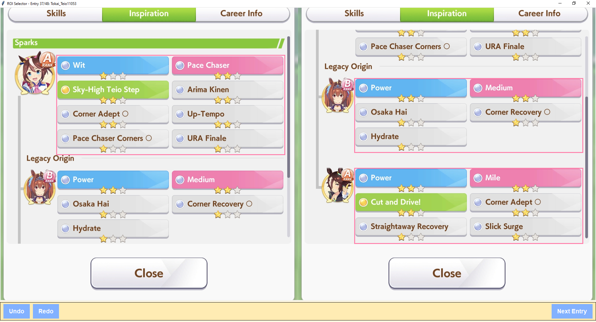

# UMA Scanner Setup Guide
A simple guide to setting up and using the UMA Scanner.

This guide will help you install and use the UMA Scanner to get information from your screenshots.

---

## Step 0: Download and Install Python

First, you need to install Python on your computer.

1.  Go to the [official Python website](https://www.python.org/downloads/).
2.  Download the latest version of Python.
3.  When you install Python, make sure to check the box that says **"Add Python to PATH"**. This is very important.
4.  To check if Python is installed correctly, open a program called **Terminal** or **Command Prompt** and type this command, then press Enter:

    ```bash
    python --version
    ```

---

## Step 1: Install Extra Tools

Next, you need to install some extra tools that the UMA Scanner needs to work. Here are two ways to do it:

**Method 1: Use the installation script (for Windows)**

1.  Find the file named `install_dependencies.bat` and double-click on it.
2.  This will automatically install everything you need.

**OR**

**Method 2: Use the `requirements.txt` file**

1.  Open your **Terminal** or **Command Prompt** in the same folder where you have the UMA Scanner files.
2.  Type this command and press Enter:

    ```bash
    pip install -r requirements.txt
    ```

---

## Step 2: Prepare and Organize Your Screenshots

1.  Put all your loose game screenshots into the `data/input_images` folder.
2.  Next, run a script that will automatically organize your screenshots into folders for each character. A simple way to do this is to open the `src` folder in your file explorer, click on the address bar, type `cmd` and press Enter. This will open a **Command Prompt** in the correct folder. Then, type the following command and press Enter:

    ```bash
    python folder_creator.py
    ```

**A quick note:**

*   Please use screenshots from a mobile phone. Screenshots from a computer will not work.

---

## Step 3: Get Information from Your Screenshots

1.  Now it's time to get the information from your screenshots. In the same **Command Prompt** window, type this command and press Enter:

    ```bash
    python image_processor.py
    ```

2.  A new window will open. In this window, you will need to draw boxes around the 'spark' areas on your screenshots for each character.
    *   Look at the example image at `assets/SparkAreaExample.PNG` to see how to do this.
    *   
3.  After you have drawn spark boxes for all your characters, the program will read the information (stats, skills, and sparks) from your screenshots.
4.  The screenshots you have finished will be moved to the `data/processed_images` folder. The information from the screenshots will be saved in the `runner_tables` folder.

---

## Step 4: See Your Results

1.  To see all the information you have collected, type this command in the same **Command Prompt** window and press Enter:

    ```bash
    python uma_analyzer_themed.py
    ```

2.  This will open a new window where you can see all the information from your screenshots in a table. You can sort and filter the table to find the information you want.

---

You're done! All your stats are now collected and ready to use.