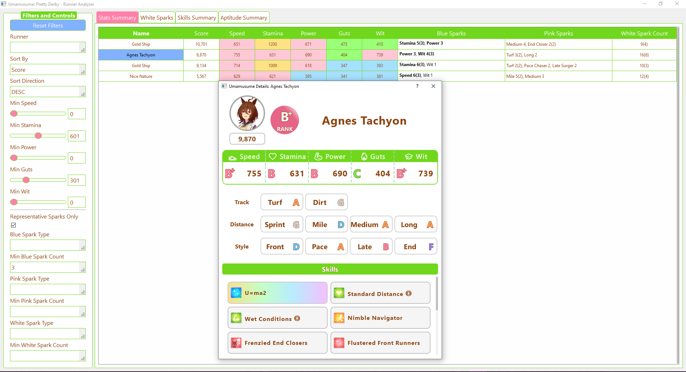
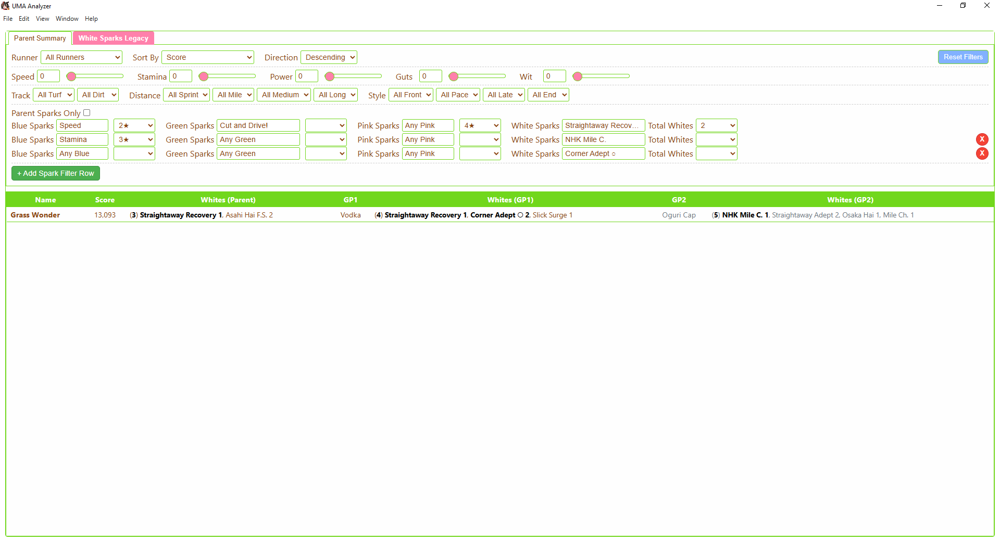
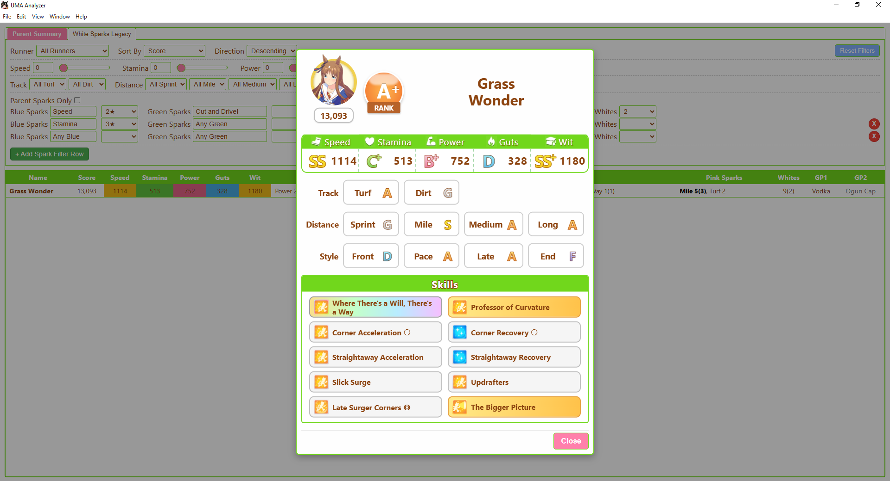

# UMA Scanner Setup Guide
A simple guide to setting up and using the UMA Scanner.

This guide will help you install and use the UMA Scanner to get information from your screenshots.


!! NOTE !!
Running this for myself takes about 15 minutes for 200 entries, so go grab something to drink and put on a video :)


## Step -1: [Optional] Add my data for the program before running your own

If you want to play with my runner data in your program to see what you can dowith it, before doing anything, change the `all-runners_Zeek.csv` file in the `data` folder to `all-runners.csv`.
I kept it in so people can play with the **Analyzer** (Described below) without putting in their own screenshots or needing to complete steps 1a, 2 or 3.
Skip to step 4 after completing step 1b.


---


## Step 0: Download and Install Python

First, you need to install Python on your computer.

1.  Go to the [official Python website](https://www.python.org/downloads/).
2.  Download the latest version of Python.
3.  When you install Python, make sure to check the box that says **"Add Python to PATH"**. This is very important.
4.  To check if Python is installed correctly, open a program called **Terminal** or **Command Prompt** and type this command, then press Enter:

    ```bash
    python --version
    ```

---

## Step 1: Install Dependencies

The installation is a two-step process. First, you will install the main deep learning library (PyTorch), then you will install the remaining application dependencies.

### Step 1a: Choose and Install PyTorch

You have two options for installing PyTorch. Using a GPU is highly recommended for performance.

*   **Performance Note:** Using a CPU is the most compatible option, but it is much slower. For a batch of 200 characters, processing can take up to **2 hours on a CPU** versus **20 minutes on a GPU**.

---

**OPTION 1: CPU Version (Recommended for compatibility)**

This is the easiest option and will work on any machine.

*   **Download Size:** ~700-900 MB
*   **Action:** Double-click and run the `install_pytorch_cpu.bat` script.

---

**OPTION 2: GPU Version (Recommended for performance)**

This option requires a compatible NVIDIA GPU and provides a ~6x speed improvement.

*   **Download Size:** ~2.5 - 4.5 GB
*   **Action:** Follow these manual steps:
    1.  **IMPORTANT:** If you have ever installed PyTorch before, uninstall it first to avoid conflicts:
        ```bash
        pip uninstall torch torchvision torchaudio
        ```
    2.  Find your maximum supported CUDA version by running this command in your terminal:
        ```bash
        nvidia-smi
        ```
        Look for the "CUDA Version" in the top-right of the output (e.g., 12.2).
    3.  Go to the [official PyTorch website](https://pytorch.org/get-started/locally/).
    4.  Use the website's tool to select your system settings and a CUDA version that is less than or equal to the one from the previous step.
    5.  Copy and run the generated `pip` command.

---

### Step 1b: Install Application Dependencies

After you have installed PyTorch using one of the options above, you can install the rest of the required libraries.

*   **Action:** Double-click and run the `install_dependencies.bat` script.

This will install all other libraries, including `EasyOCR`, needed to run the scanner.

---


## Step 2: Prepare Your Screenshots

1.  Put all your loose game screenshots into the `data/input_images` folder. The system will automatically organize them when you run `image_processor.py` in step 3.

**A quick note:**

*   Please use screenshots from a mobile phone. Screenshots from a computer will not work.

---

## Step 3: Process Your Screenshots

1.  Run the main processing script from your **Terminal** or **Command Prompt**. Make sure you are in the project's root folder.

    ```bash
    python src/image_processor.py
    ```

2.  The script will perform the following steps automatically:
    *   **Groups Loose Images:** Any loose screenshots in `data/input_images` are automatically organized into character folders based on their name and score.
    *   **Detects ROIs:** The script automatically detects the spark information regions from your screenshots.
    *   **Processes Data:** It then extracts all stats, ranks, skills, and sparks for each character.
    *   **Handles Conflicts:** If the script finds conflicting data for a character that has been processed before (e.g., you are re-processing updated screenshots), a **Conflict Resolution** window will appear. This allows you to choose which data to keep.
    *   **Saves Results:** The extracted data is saved in `data/all_runners.csv`, and the processed character folders are moved from `data/input_images` to `data/processed_images`.

---

## Step 4: View Your Results

1.  To view the collected data, run the analyzer application from your **Terminal** or **Command Prompt**:

    ```bash
    python src/uma_analyzer_themed.py
    ```

2.  This opens a graphical interface where you can see all your runners' data in a sortable and filterable table.
   
3.  You can double-click on any runner in the "Stats Summary" tab to see a detailed view of their stats, skills, and aptitudes.
    *   Here's an image at the `assets/ExampleAnalyzerView.png`s as a reference for how the ui looks and what you can do with it.
    
    
    

---
